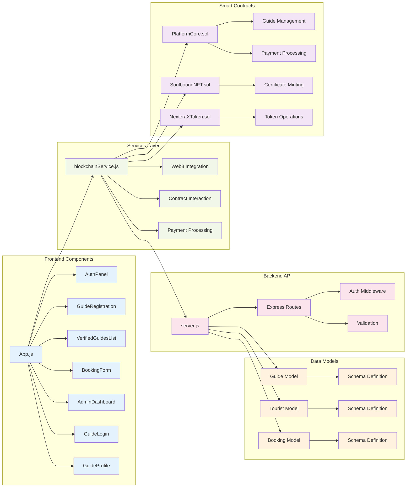
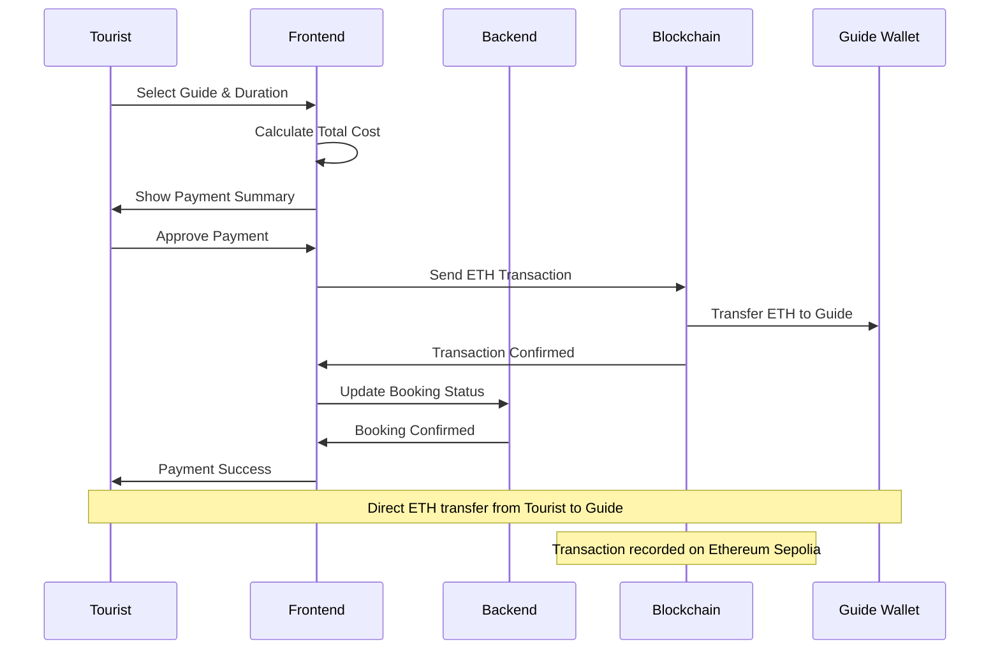
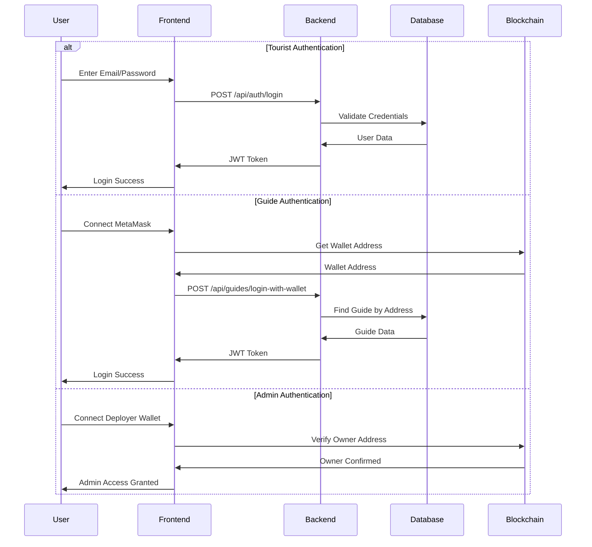
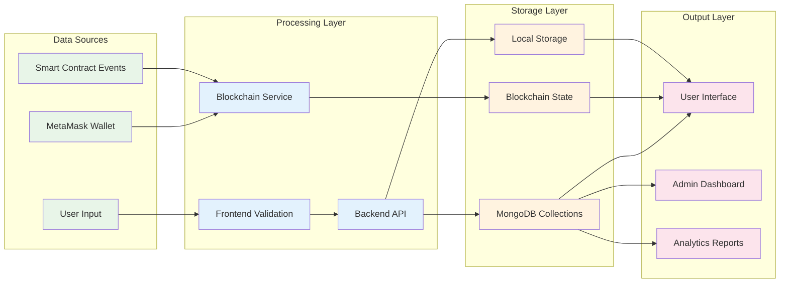
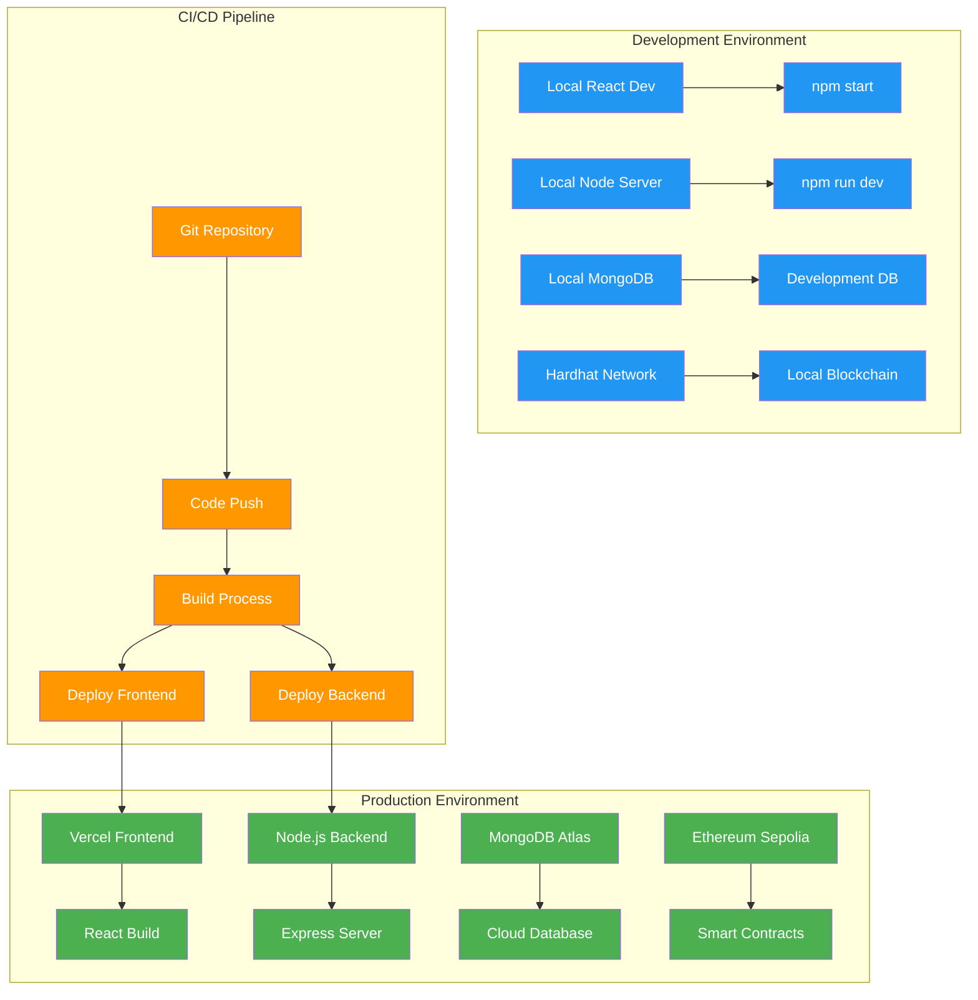

# NexteraX - Architecture & Workflow Diagrams

## 🏗️ System Architecture Diagram



```mermaid
graph TB
    subgraph "Frontend Layer"
        A[React App] --> B[AuthPanel]
        A --> C[GuideRegistration]
        A --> D[VerifiedGuidesList]
        A --> E[BookingForm]
        A --> F[AdminDashboard]
        A --> G[GuideLogin]
        A --> H[GuideProfile]
    end

    subgraph "Backend Layer"
        I[Express.js Server] --> J[Auth Routes]
        I --> K[Guide Routes]
        I --> L[Booking Routes]
        I --> M[Admin Routes]
        I --> N[JWT Middleware]
    end

    subgraph "Database Layer"
        O[MongoDB Atlas] --> P[Guides Collection]
        O --> Q[Tourists Collection]
        O --> R[Bookings Collection]
        O --> S[Analytics Collection]
    end

    subgraph "Blockchain Layer"
        T[Ethereum Sepolia] --> U[PlatformCore Contract]
        T --> V[SoulboundNFT Contract]
        T --> W[NexteraXToken Contract]
    end

    subgraph "External Services"
        X[MetaMask Wallet]
        Y[Thirdweb SDK]
        Z[Hardhat Network]
    end

    %% Frontend to Backend
    A -->|HTTP/API Calls| I
    B -->|Auth Requests| J
    C -->|Guide Registration| K
    D -->|Guide Listing| K
    E -->|Booking Creation| L
    F -->|Admin Operations| M
    G -->|Guide Auth| K
    H -->|Profile Management| K

    %% Backend to Database
    I -->|Mongoose ODM| O
    J -->|User Data| P
    J -->|User Data| Q
    K -->|Guide Data| P
    L -->|Booking Data| R
    M -->|All Collections| O

    %% Frontend to Blockchain
    A -->|Web3 Integration| Y
    Y -->|Contract Interaction| T
    X -->|Wallet Connection| A
    X -->|Transaction Signing| T

    %% Backend to Blockchain
    I -->|Admin Operations| T
    M -->|Guide Verification| U
    M -->|NFT Minting| V

    %% Development Tools
    Z -->|Contract Deployment| T
    Z -->|Testing| U
    Z -->|Testing| V
    Z -->|Testing| W

    %% Styling
    classDef frontend fill:#e1f5fe
    classDef backend fill:#f3e5f5
    classDef database fill:#e8f5e8
    classDef blockchain fill:#fff3e0
    classDef external fill:#fce4ec

    class A,B,C,D,E,F,G,H frontend
    class I,J,K,L,M,N backend
    class O,P,Q,R,S database
    class T,U,V,W blockchain
    class X,Y,Z external
```

## 🔄 User Workflow Diagrams

### 1. Tourist Journey Workflow

```mermaid
flowchart TD
    A[Tourist Visits Site] --> B{Choose Role}
    B -->|Tourist| C[Connect MetaMask]
    C --> D[Register/Login]
    D --> E[Enter Email & Password]
    E --> F[Optional: Add Wallet Address]
    F --> G[Authentication Success]
    G --> H[View Verified Guides]
    H --> I[Select Guide]
    I --> J[Check Guide Availability]
    J -->|Available| K[Fill Booking Form]
    J -->|Booked| L[Choose Different Guide]
    L --> H
    K --> M[Enter Duration & Details]
    M --> N[Calculate Total Cost]
    N --> O[Connect Wallet for Payment]
    O --> P[Approve ETH Transaction]
    P --> Q[Payment Success]
    Q --> R[Booking Confirmed]
    R --> S[Service Completion]
    S --> T[End]

    %% Error Handling
    C -->|Connection Failed| U[Retry Connection]
    U --> C
    P -->|Transaction Failed| V[Retry Payment]
    V --> P
    D -->|Auth Failed| W[Show Error Message]
    W --> D

    %% Styling
    classDef start fill:#4caf50,color:#fff
    classDef process fill:#2196f3,color:#fff
    classDef decision fill:#ff9800,color:#fff
    classDef error fill:#f44336,color:#fff
    classDef end fill:#9c27b0,color:#fff

    class A,T start
    class C,D,E,F,G,H,I,K,M,N,O,P,Q,R,S process
    class B,J decision
    class U,V,W error
```

### 2. Guide Journey Workflow

```mermaid
flowchart TD
    A[Guide Visits Site] --> B{Choose Role}
    B -->|Guide| C[Connect MetaMask]
    C --> D{Existing Guide?}
    D -->|Yes| E[Guide Login]
    D -->|No| F[Guide Registration]
    
    E --> G[Enter Wallet Address]
    G --> H[Authentication Success]
    H --> I[Guide Dashboard]
    I --> J[View Profile & Bookings]
    J --> K[Manage Availability]
    K --> L[Toggle Available/Booked]
    L --> M[Profile Updated]
    M --> I
    
    F --> N[Enter Personal Details]
    N --> O[Enter Service Rate ETH/min]
    O --> P[Submit Registration]
    P --> Q[Wait for Admin Verification]
    Q --> R{Admin Decision}
    R -->|Approved| S[NFT Certificate Minted]
    R -->|Rejected| T[Registration Denied]
    S --> U[Guide Verified]
    U --> I
    T --> V[End - Reapply Later]
    
    %% Error Handling
    C -->|Connection Failed| W[Retry Connection]
    W --> C
    E -->|Auth Failed| X[Show Error Message]
    X --> E
    P -->|Registration Failed| Y[Retry Registration]
    Y --> P

    %% Styling
    classDef start fill:#4caf50,color:#fff
    classDef process fill:#2196f3,color:#fff
    classDef decision fill:#ff9800,color:#fff
    classDef error fill:#f44336,color:#fff
    classDef end fill:#9c27b0,color:#fff

    class A,V end
    class C,E,F,G,H,I,J,K,L,M,N,O,P,Q,S,U process
    class B,D,R decision
    class W,X,Y error
```

### 3. Admin Workflow

```mermaid
flowchart TD
    A[Admin Visits Site] --> B[Access Admin Panel]
    B --> C[Connect Deployer Wallet]
    C --> D[Admin Dashboard]
    D --> E[View Pending Guides]
    E --> F[Review Guide Application]
    F --> G{Decision}
    G -->|Approve| H[Verify Guide on Blockchain]
    G -->|Reject| I[Mark as Rejected]
    
    H --> J[Mint Soulbound NFT]
    J --> K[Update Guide Status]
    K --> L[Guide Now Available]
    
    I --> M[Guide Rejected]
    
    D --> N[View Analytics]
    N --> O[Total Guides]
    N --> P[Total Bookings]
    N --> Q[Revenue Metrics]
    
    D --> R[Manage Verified Guides]
    R --> S[View Guide Details]
    S --> T[Force On-Chain Verify]
    T --> U[Manual Verification]
    
    %% Error Handling
    C -->|Connection Failed| V[Retry Connection]
    V --> C
    H -->|Verification Failed| W[Retry Verification]
    W --> H
    J -->|Minting Failed| X[Retry Minting]
    X --> J

    %% Styling
    classDef start fill:#4caf50,color:#fff
    classDef process fill:#2196f3,color:#fff
    classDef decision fill:#ff9800,color:#fff
    classDef error fill:#f44336,color:#fff
    classDef end fill:#9c27b0,color:#fff

    class A end
    class B,C,D,E,F,H,I,J,K,L,M,N,O,P,Q,R,S,T,U process
    class G decision
    class V,W,X error
```

## 🔧 Technical Component Diagram



## 💰 Payment Flow Diagram



## 🔐 Authentication Flow Diagram



## 📊 Data Flow Diagram



## 🚀 Deployment Architecture



---

## 📋 Key Features Summary

### **Frontend Features**
- ✅ Role-based authentication (Tourist, Guide, Admin)
- ✅ MetaMask wallet integration
- ✅ Responsive modern UI with animations
- ✅ Real-time guide availability
- ✅ Secure payment processing
- ✅ Admin dashboard with analytics

### **Backend Features**
- ✅ RESTful API with Express.js
- ✅ JWT-based authentication
- ✅ MongoDB data persistence
- ✅ Guide verification system
- ✅ Booking management
- ✅ Analytics and reporting

### **Blockchain Features**
- ✅ Smart contract integration
- ✅ Soulbound NFT certificates
- ✅ Native ETH payments
- ✅ Guide verification on-chain
- ✅ Transparent transaction records

### **Security Features**
- ✅ Wallet-based authentication
- ✅ JWT token security
- ✅ Input validation and sanitization
- ✅ Secure payment processing
- ✅ Role-based access control

This architecture provides a robust, scalable, and secure platform for blockchain-enabled tourism services with clear separation of concerns and modern development practices.


